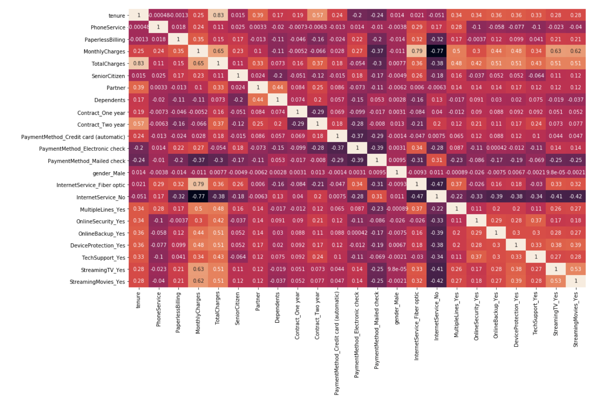

# Telecom Churn Case Study

With 21 predictor variables, this project aims to predict whether a customer will switch to another telecom provider (churn) or remain loyal (not churn). This is a critical task for telecom companies to improve customer retention strategies.

## Table of Contents
1. [Introduction](#introduction)
2. [Data Processing](#data-processing)
   - [Step 1: Importing and Merging Data](#step-1-importing-and-merging-data)
   - [Step 2: Inspecting the Data](#step-2-inspecting-the-data)
   - [Step 3: Data Preparation](#step-3-data-preparation)
   - [Step 4: Test-Train Split](#step-4-test-train-split)
   - [Step 5: Feature Scaling](#step-5-feature-scaling)
3. [Correlation Analysis](#correlation-analysis)
4. [Model Building](#model-building)
   - [Step 6: Building Logistic Regression Model](#step-6-building-logistic-regression-model)
   - [Step 7: Feature Selection Using RFE](#step-7-feature-selection-using-rfe)
   - [Step 8: Plotting the ROC Curve](#step-8-plotting-the-roc-curve)
   - [Step 9: Finding Optimal Cutoff Point](#step-9-finding-optimal-cutoff-point)
   - [Step 10: Making Predictions on the Test Set](#step-10-making-predictions-on-the-test-set)
5. [Model Evaluation](#model-evaluation)
   - [Accuracy](#accuracy)
   - [Confusion Matrix](#confusion-matrix)
   - [Sensitivity](#sensitivity)
   - [Specificity](#specificity)
6. [Conclusion](#conclusion)

---

## Introduction

In this case study, we aim to predict whether a particular customer will churn or not based on various features such as tenure, contract type, monthly charges, and more.

## Data Processing

### Step 1: Importing and Merging Data
We begin by importing the dataset and performing necessary merges to unify data sources for modeling.

### Step 2: Inspecting the Data
We examine the structure of the dataframe, looking for missing values, data types, and anomalies.

### Step 3: Data Preparation
Handle missing values, encode categorical variables, and perform other data cleaning processes.

### Step 4: Test-Train Split
Split the data into training and test sets to build and evaluate the model.

### Step 5: Feature Scaling
Apply scaling techniques (e.g., standardization) to ensure the model performs optimally.

## Correlation Analysis

Explore the correlation between features to understand their relationships. Below is a correlation heatmap:



## Model Building

### Step 6: Building Logistic Regression Model
We build a logistic regression model to predict customer churn.

### Step 7: Feature Selection Using RFE
Use Recursive Feature Elimination (RFE) to select the most important features.

### Step 8: Plotting the ROC Curve
Plot the ROC curve to evaluate the performance of the logistic regression model.

### Step 9: Finding Optimal Cutoff Point
Determine the cutoff point that maximizes sensitivity and specificity.

### Step 10: Making Predictions on the Test Set
Use the model to make predictions on the test set and evaluate the results.

## Model Evaluation

### Accuracy
The overall accuracy of the model is:

```python
metrics.accuracy_score(y_pred_final.Churn, y_pred_final.final_predicted)
# Output: 0.7834
